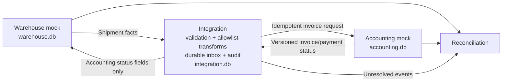

# Reliable two-way business system integration

**A successful API call is not the same thing as a reliable integration.**

This reference project demonstrates a two-way synchronization pattern between warehouse and accounting systems, designed around failures that occur in real business workflows: duplicate events, malformed records, partial failures, conflicting updates, and systems silently drifting out of agreement.

A distribution company should not need to re-key shipment quantities into accounting or guess whether a paid invoice has reached the warehouse. This project turns those questions into explicit ownership rules, durable delivery state, and a report of actual agreement.

**First usable checkpoint:** Python standard library, three independent SQLite databases, a reproducible failure demo, automated tests, and CI. No API keys, paid services, or dependency installation required. This is a runnable architecture reference, not a production connector or a complete accounting product.

## See it in two minutes

Requires Python **3.11+** and Git. Run from the repository root. Commands work in PowerShell, macOS, and Linux; Windows may use `py` instead of `python`.

```sh
git clone https://github.com/bruceatom/reliable-two-way-system-sync.git
cd reliable-two-way-system-sync
python -m unittest discover -s tests -v
python -m src.cli --data demo-data demo
python -m src.cli --data demo-data reconcile
python -m src.cli --data demo-data audit
```

The demo intentionally leaves one rejected shipment visible. Its `reconcile` command exits **1**, because the systems do not fully agree. That is the expected result, not a hidden success. Use a new data directory for another demo run; the command refuses to overwrite an existing scenario.

For a clean business flow, use a separate directory:

```sh
python -m src.cli --data happy-data seed SHP-001
python -m src.cli --data happy-data sync
python -m src.cli --data happy-data pay SHP-001
python -m src.cli --data happy-data sync
python -m src.cli --data happy-data reconcile
```

This ends with one shipment, one matching invoice, paid status in both systems, no unresolved events, and exit code **0**.

## Business problem

Manual re-entry creates quantity mistakes. Incompatible formats cause rejected records. A timeout may leave an invoice created even though the caller thinks it failed. Repeated deliveries can double bill a customer. A green API response can coexist with missing records, stale payment status, or changed quantities.

This prototype answers a narrower, useful question: **Did each shipped quantity reach accounting exactly once, and did accounting's current invoice/payment state return to the correct warehouse shipment?** It exposes discrepancies so an operator can investigate them instead of trusting delivery counts.

## Architecture and ownership



| Data | System of record | Direction / treatment |
| --- | --- | --- |
| Shipment ID, order ID, SKU, shipped quantity, fulfillment status | Warehouse | Warehouse → accounting; immutable after invoicing in this prototype |
| Invoice ID, invoice status, payment status, status version | Accounting | Accounting → warehouse; versioned mirror only |
| Delivery state, attempts, error, audit history | Integration | Never used as a substitute for business-record reconciliation |
| Inventory on hand, prices, tax, totals, customer master | Outside this checkpoint | No claim of inventory or monetary reconciliation |

The invoice transform includes only warehouse-owned shipment facts. The reverse transform includes only accounting-owned fields. Warehouse status updates never emit new shipment facts, so returning a payment does not create a synchronization loop. Unknown shipments and conflicting invoice IDs are rejected.

There are **three databases**, not a shared transaction pretending to be two APIs. Accounting can commit an invoice and then raise a timeout before the integration marks its event complete. That deliberate separation makes the uncertainty demonstrable.

## Reliability controls

| Failure | Control | Observable evidence |
| --- | --- | --- |
| Duplicate event ID | Durable inbox keyed by event ID and payload fingerprint | Completed event is not processed again; redelivery is audited |
| Same shipment under a new event ID | Unique shipment key at the destination plus fact fingerprint | Exactly one invoice; changed facts become a conflict |
| Same event ID with different content | Separate durable conflict record; original event is preserved | `conflict` count blocks healthy reconciliation; audit retains payload |
| Malformed records | Strict identifiers, integer quantities, allowed statuses and positive versions | Quarantine with original payload and reason; no invoice write |
| Temporary failure before write | Persisted recoverable event | Explicit retry command can recover it |
| Timeout after commit | Replay the same business key; destination returns existing invoice | Restart test proves one invoice survives ambiguous outcome |
| Repeated failure | Three total attempts, then dead letter | Retry stops; unresolved count stays visible |
| Out-of-order payment update | Accounting-owned monotonic status version | Older version skipped; same-version disagreement quarantined |
| One shipment conflicts | Poll isolates the event conflict | Other shipments continue processing |
| Silent business drift | Compare IDs, order, SKU, quantity, mirrored status, and versions | Missing/orphan records and field-level discrepancies reported |
| Delivery queues unresolved despite matching records | Reconciliation includes integration state | Matching records alone cannot produce a healthy result |

**Delivery semantics:** at least once, with an idempotent destination operation. This is not an exactly-once distributed transaction. Production accounting must support a durable idempotency key or equivalent unique business constraint; a local inbox alone cannot protect against a timeout after the remote write.

The worker is intentionally single-process. Retries happen when an operator invokes `retry` or another sync pass sees a recoverable event. There is no automatic scheduler or timed backoff in this checkpoint. Completed, quarantined, and dead-letter events are not blindly replayed.

## Demonstrated output

The demo first simulates an accounting timeout **after** invoice creation, then retries, delivers a duplicate, rejects a string quantity, marks the valid invoice paid, and sends its status back.

```text
1. Timeout after committed invoice (recoverable)
"retry"
2. Retry persisted event; destination idempotency prevents a second invoice
{"shipment-SHP-001": "done"}
3. Duplicate delivery
"done"
4. Invalid quantity quarantined
"quarantined"
```

Its final reconciliation contains:

```json
{
  "warehouse_shipments": 2,
  "accounting_invoices": 1,
  "matched": 1,
  "exception_count": 1,
  "exceptions": [
    {"shipment_id": "SHP-002", "reasons": ["missing_invoice"]}
  ],
  "event_states": {"done": 2, "quarantined": 1},
  "unresolved_events": 1,
  "healthy": false
}
```

Full captured output lives in [examples/demo-output.txt](examples/demo-output.txt). Reconciliation exceptions count distinct shipment IDs; each may have multiple reasons. Unresolved events are counted separately, including retained event-ID conflicts. An empty dataset is considered consistent, so healthy alone does not prove a worker is active or receiving data.

## Commands and operations

```sh
python -m src.cli --data data seed SHP-001  # one valid mock shipment
python -m src.cli --data data sync          # poll both mock systems
python -m src.cli --data data pay SHP-001   # change accounting-owned payment status
python -m src.cli --data data retry         # one pass over pending/retry events
python -m src.cli --data data reconcile     # actual business consistency report
python -m src.cli --data data audit         # timestamped integration audit
```

`sync`, `retry`, and `reconcile` return **0** for healthy agreement and **1** for unresolved events or discrepancies. `retry` only replays delivery; a subsequent `sync` may be required to mirror newly created accounting status. Expected input/conflict errors return **2**. Unexpected database/programming errors propagate visibly rather than being reported as success. The educational `demo` returns 0 when the scripted demonstration completes, even though its final report is unhealthy by design.

Inspect `audit` and the `events` table in `integration.db` for direction, original payload, state, attempt count, and error. The separate `conflicts` table preserves reused-event payloads. This version has no operator resolution command; quarantine, conflicts, and dead letters require investigation and a future explicit repair workflow. Do not clear errors merely to make a dashboard green.

## Automated QA

```sh
python -m unittest discover -s tests -v
```

**20 tests pass locally on Python 3.12.14.** The suite covers two-way payment flow, duplicates with both identical and different event IDs, changed invoice facts, reused-ID conflicts, invalid quantities/SKUs, failures before and after commit, durable replay after reopening all databases, bounded retries, ownership protection, stale and conflicting status versions, orphan statuses, maximum-length identifiers, conflict isolation, reconciliation drift/missing/orphan records, unresolved-event health, and nonzero CLI failure status.

Tests create isolated temporary databases. The [GitHub Actions workflow](.github/workflows/tests.yml) runs the suite and demo on Windows/Linux with Python 3.11/3.12. Hosted CI status should be checked on the Actions tab; local passing results are not a claim that hosted checks have already completed.

## Code map

```text
src/adapters/warehouse.py   warehouse mock and versioned status mirror
src/adapters/accounting.py  accounting mock, business-key uniqueness, injected timeouts
src/validation.py          deterministic boundary validation
src/transform.py           allowlist mappings and canonical fingerprints
src/idempotency.py         durable inbox, conflict retention, audit history
src/sync.py                directional delivery, retries, poll isolation
src/reconciliation.py      record/fact/status comparison plus unresolved event checks
src/cli.py                 reproducible demo and operator commands
tests/test_integration.py  failure-focused automated tests
NEXT_STEPS.md              resumable checkpoint and prioritized next work
```

## Current boundaries

- Mock adapters only; no HTTP client, credentials, webhooks, pagination, rate limits, or live ERP integration.
- One SKU line per immutable shipment; no split allocations, returns, cancellations, credit notes, money, tax, or inventory balances.
- Status version checks assume accounting increments versions correctly. Source correction handling intentionally raises a conflict rather than overwriting invoiced facts.
- Single worker only: no atomic claim/lease, concurrent-worker guarantees, or durable upstream event broker. Polling reconstructs events from current snapshots; intermediate payment transitions can be missed.
- No scheduled retry/backoff, operator repair/release command, alert delivery, freshness heartbeat, retention policy, schema migrations, or production security hardening.
- SQLite audit is useful for a demo but is not tamper-proof. Payloads may contain business data; real deployments need access controls and redaction.

The next step is a supervised recovery workflow for quarantined/conflicting/dead-letter events, followed by one real adapter with contract tests. See [NEXT_STEPS.md](NEXT_STEPS.md) for exact resumption commands and acceptance criteria.
